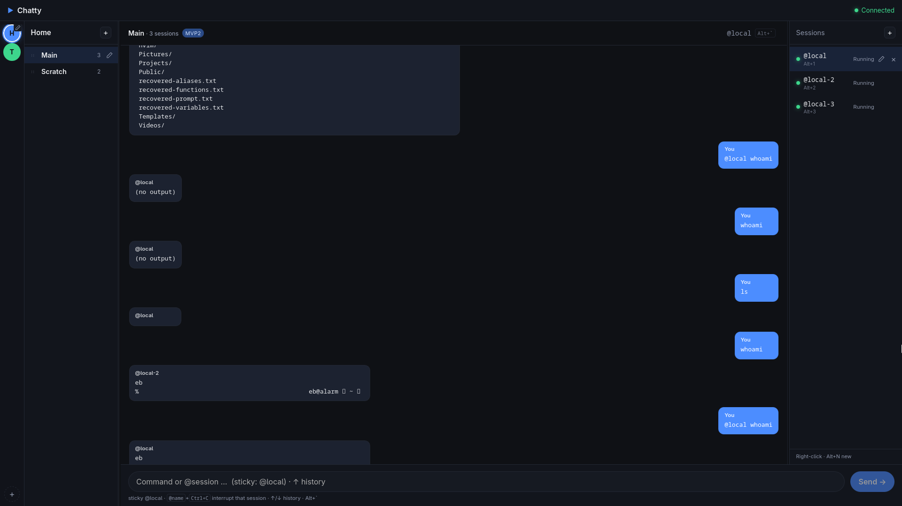

# ChaTTY

Conversational terminal: Discord-style chat chrome over local (and later multi) shell sessions.

**Yes, this is vibecoded. It's only a proof of concept to see if it's possible.**

**Repo:** [github.com/Ebsolas/ChaTTY](https://github.com/Ebsolas/ChaTTY)



## Stack

- **Tauri 2** (Rust) — desktop shell + PTY backend
- **SvelteKit** + Vite — UI
- Local interactive PTY sessions (chat + terminal views)
- **chatty-host** — durable session process on Linux (AppImage bundles it)

## Download (Linux)

Prebuilt **AppImage** (x86_64) and `.deb` are on [GitHub Releases](https://github.com/Ebsolas/ChaTTY/releases):

```bash
chmod +x Chatty_*.AppImage
./Chatty_*.AppImage
```

On some desktops you may need “Allow launching” / execute permission in file properties.

The AppImage includes **chatty-host** so sessions can outlive the UI. Windows builds are planned next.

## Develop

```bash
npm install
npm run tauri dev
```

Frontend-only (no native shell):

```bash
npm run dev
```

## Build

```bash
# Stages chatty-host sidecar, then builds AppImage (+ deb on supported hosts)
npm run tauri:build

# Dev without packaging:
npm run tauri dev

# After a release binary build:
./scripts/run-chatty.sh
```

AppImage output:

```text
src-tauri/target/release/bundle/appimage/Chatty_*.AppImage
```

If `linuxdeploy` fails on Arch (gtk plugin path quirks), `npm run tauri:build` falls back to packing the prepared AppDir with `appimagetool`. Set `APPIMAGE_EXTRACT_AND_RUN=1` if FUSE is unavailable.

## Status

### What works (MVP / MVP2)

- Chat and session terminal share a **login interactive PTY** per session.
- Composer injects lines; session typing creates chat turns (line mode; TUIs skipped).
- Multi-session: add / remove / rename / reorder; `@session` targeting and sticky target.
- **Groups → conversations → sessions** rails with drag reorder.
- Busy / TUI indicators; open terminal with `Alt+`` / `Alt+1`–`9` / click.
- Cap: 16 concurrent shells. Chat history for closed sessions is kept.

### Keybindings

Defaults use **Alt** as the in-app navigation modifier. Customize:

```bash
# Created on first launch:
~/.config/chatty/keybindings.json

# Example in repo:
config/keybindings.example.json
```

| Action | Default |
|--------|---------|
| Toggle session terminal | `Alt+`` |
| Session 1–9 | `Alt+1` … `Alt+9` |
| New (focused rail) | `Alt+N` |
| Close highlighted | `Alt+W` |
| Rename highlighted | `Alt+R` |
| Focus composer | `Alt+C` |
| Focus groups / conversations / sessions | `Alt+G` / `Alt+Shift+C` / `Alt+S` |
| Jump palette | `Alt+P` |
| Next / previous session | `Alt+]` / `Alt+[` |
| Cycle focus region | `Tab` / `Shift+Tab` (rails + composer only) |
| List up / down (in focused rail) | `↑` `↓` or `k` `j` |
| Activate selection | `Enter` |
| Back out layers | `Esc` |

**Rename**

| Item | How |
|------|-----|
| **Group** | Pencil on the **group name** (conversations header), double-click the title, context menu on monogram, or `Alt+R` with groups focused |
| **Conversation / session** | Pencil / right-click → Rename / `Alt+R` while that rail is focused |

Composer **↑ / ↓** recalls command history (persisted in localStorage). Each session has its own chat capture, so a TUI or long job on `@local` does not block `@local-2`.

### Groups & conversations

Hierarchy: **Group → Conversation → Sessions + chat**.

| Rail | Content |
|------|---------|
| Far left (thin) | **Groups** as monogram circles (initial + color) |
| Next | **Conversations** in the active group; header shows the **group name** (rename here) |
| Right | **Sessions** for the active conversation |

| Action | Groups | Conversations |
|--------|--------|----------------|
| Switch | Click icon | Click row |
| New | `+` under icons (seeds conversation + session) | `+` in header (seeds a session) |
| Rename | Header title pencil / dblclick / monogram context / `Alt+R` | Pencil / context / `Alt+R` |
| Color | Context menu → Color… | — |
| Reorder | Drag / Move up·down | Drag / Move up·down |
| Delete | Context menu (kills nested sessions); last group reseeds **Home** | Context menu; last conversation reseeds **Main** |

Switching groups/conversations **unloads UI** only — PTYs keep running. Background finishes toast when you’re in another conversation.

### Persistence

On quit/restart Chatty restores **groups, conversations**, session **names, order, cwd, sticky target, and chat history** from:

```text
~/.config/chatty/state.json
```

### Session hosting (this machine only)

Default engine is **`chatty-host`** (durable PTY process that outlives the UI):

| Piece | Role |
|-------|------|
| `chatty-host` | Owns PTYs, ring buffer, process activity; listens on `$XDG_RUNTIME_DIR/chatty/host.sock` |
| Chatty UI | Attaches/detaches; quit does **not** kill host sessions |
| Close session in rail | Host **destroys** that PTY (confirm if busy/TUI) |

```bash
# Optional overrides
CHATTY_SESSION_ENGINE=host     # default on Unix
CHATTY_SESSION_ENGINE=legacy   # old in-process tmux/plain path
CHATTY_HOST_BIN=/path/to/chatty-host
```

Build the host next to the app: `cargo build --manifest-path src-tauri/Cargo.toml --bin chatty-host` (or use `npm run stage:host`).

Legacy fallback (`CHATTY_SESSION_ENGINE=legacy`): tmux when available, else plain PTY.

**Activity (busy / TUI)** comes from the host’s process-tree poll (same idea as tmux `pane_current_command`, without requiring tmux).

Closing a session that is **busy** or in a **TUI** is blocked with a warning until the job/UI exits (or you force-close later).

### Roadmap (high level)

1. Stabilize Linux downloads (AppImage smoke, optional aarch64 CI)
2. Windows: shell + ConPTY + installer for first test builds
3. Windows durable host (named pipes — parity with Linux chatty-host)
4. Later: signing, auto-update, macOS

Deferred / not goals of this PoC: production polish, SSH product surface, store packaging.
