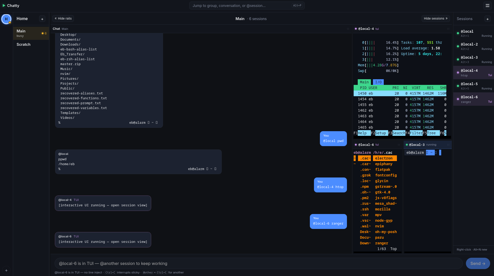

# ChaTTY

Yes, this is vibecoded. It's only a proof of concept to see if it's possible.

**ChaTTY** is a desktop app that turns your shell into a chat-style workspace. You run local (and soon remote) sessions as named terminals, see command output as conversation turns, and arrange multiple PTYs in a flexible multi-pane layout—like a light tmux or tiling window manager inside a modern UI.

Use it when you want durable shells, clear session identity, and chat-first navigation without giving up a real interactive terminal (vim, htop, ranger, and other TUIs included).



## Features

- **Chat + terminal per session** — Composer and terminal share a login interactive PTY. Session typing becomes chat turns in line mode; TUIs stay out of the log until you leave them.
- **Groups → conversations → sessions** — Organize work the way you think about projects, not only process IDs.
- **Multi-pane workspace** — Split, resize, swap, move, and drag panes freely. Open as many terminal panes as you need; they never clobber an existing pane unless you replace deliberately.
- **Focused terminal overlay** — Expand one session full-surface when you need an uninterrupted TUI.
- **Durable host process** — On Linux, `chatty-host` keeps sessions alive when you quit the UI.
- **Shell profiles** — Spawn templates for bash, zsh, SSH destinations, and more (`~/.config/chatty/profiles.json`).

## Get ChaTTY

Source and releases: [github.com/Ebsolas/ChaTTY](https://github.com/Ebsolas/ChaTTY)

Prebuilt **AppImage** (x86_64), **portable `.tar.gz`**, and `.deb` packages are on [GitHub Releases](https://github.com/Ebsolas/ChaTTY/releases).

### AppImage (typical desktop Linux)

```bash
chmod +x Chatty_*.AppImage
./Chatty_*.AppImage
```

On some desktops, enable “Allow launching” or mark the file executable in file properties.

### SteamOS / Steam Deck (x86_64)

SteamOS often can’t mount AppImages (no user FUSE). Prefer the portable tarball when the release includes it, or extract and run the AppImage:

```bash
# Option A — portable (recommended when available)
tar -xzf Chatty_*_linux_x86_64_portable.tar.gz
cd Chatty_*_linux_x86_64_portable
./run-chatty.sh

# Option B — AppImage without FUSE
chmod +x Chatty_*.AppImage
APPIMAGE_EXTRACT_AND_RUN=1 WEBKIT_DISABLE_DMABUF_RENDERER=1 ./Chatty_*.AppImage
```

Tips:

- Use **Desktop Mode**, not Gaming Mode, for a normal windowed app.
- Run from a terminal so crash messages print.
- If the window never appears, try:
  ```bash
  WEBKIT_DISABLE_DMABUF_RENDERER=1 GDK_BACKEND=x11 ./run-chatty.sh
  ```
- Prefer AppImage extract mode or the portable tarball over `.deb` on immutable SteamOS.

Bundles include **chatty-host** so sessions can outlive the UI. Windows builds are planned next.

## Build from source

### Prerequisites

- Node.js and npm
- Rust toolchain (for Tauri)
- Linux system libraries required by Tauri / WebKit (see [Tauri prerequisites](https://v2.tauri.app/start/prerequisites/))

### Develop

```bash
npm install
npm run tauri dev
```

Frontend only (no native shell):

```bash
npm run dev
```

### Release build

```bash
# Stages chatty-host sidecar, then builds AppImage (+ deb on supported hosts)
npm run tauri:build
```

AppImage output:

```text
src-tauri/target/release/bundle/appimage/Chatty_*.AppImage
```

After a release binary build, you can also run:

```bash
./scripts/run-chatty.sh
```

If `linuxdeploy` fails on Arch (GTK plugin path quirks), `npm run tauri:build` falls back to packing the prepared AppDir with `appimagetool`. Set `APPIMAGE_EXTRACT_AND_RUN=1` if FUSE is unavailable.

Build the host alone:

```bash
cargo build --manifest-path src-tauri/Cargo.toml --bin chatty-host
# or
npm run stage:host
```

## Stack

| Layer | Role |
|-------|------|
| **Tauri 2** (Rust) | Desktop shell and PTY backend |
| **SvelteKit** + Vite | UI |
| **chatty-host** | Durable session process on Linux (bundled in AppImage) |

## Use ChaTTY

### Workspace panes

- **Alt+Enter** — Open a **new** pane and pick which session fills it.
- **Alt+Shift+1…9** — Open conversation session *N* in a new pane (no picker).
- **Alt+Shift+Enter** — Replace the focused terminal pane via session picker (Esc restores the previous session).
- **Alt+←↑→↓** — Move focus between panes (tree-aware; follows columns and rows).
- **Alt+Shift+arrows** — Resize.
- **Ctrl+Alt+arrows** — Swap with neighbor (focus follows your session).
- **Ctrl+Alt+Shift+arrows** — Move pane toward neighbor.
- **Alt+Shift+=** / **Alt+Shift+-** — Split right / down.
- Drag a pane **title bar** onto another pane: edges split that way; center swaps.
- **Ctrl+=** / **Ctrl+-** — Zoom the **focused pane** only (terminal font or chat scale). **Ctrl+0** resets that pane.
- **Ctrl+Shift+=** / **Ctrl+Shift+-** — Zoom the **whole app**. **Ctrl+Shift+0** resets app zoom.

Closing a workspace pane does **not** kill the session. Use the sessions rail to destroy a PTY.

### Default keybindings (scheme v6)

**Alt** drives ChaTTY chrome (works even inside a TUI). **Ctrl** stays with the shell and tools like vim, except **Ctrl+Alt** pane reorg chords. Super/Win is left for your window manager. Common Linux desktop shortcuts (for example **Alt+\`**, **Alt+Tab**, **Alt+F2/F4**, **Alt+Space**) are avoided.

Customize: `~/.config/chatty/keybindings.json`  
Example in repo: `config/keybindings.example.json`

| Action | Default |
|--------|---------|
| Jump / palette | `Alt+P` |
| Focus chat pane / composer | `Alt+C` |
| New item (focused rail) | `Alt+N` |
| Toggle focused terminal | `Alt+T` |
| Toggle left rails | `Alt+B` |
| Toggle sessions rail | `Alt+Shift+S` |
| New pane (session picker) | `Alt+Enter` |
| Open session 1–9 in new pane | `Alt+Shift+1` … `Alt+Shift+9` |
| Replace focused pane session | `Alt+Shift+Enter` |
| Close workspace pane | `Alt+Shift+W` |
| Rename highlighted item | `Alt+R` |
| Kill session (sessions rail focused) | `Delete` or rail × |
| Focus / resize panes | `Alt+arrows` / `Alt+Shift+arrows` |
| Swap / move panes | `Ctrl+Alt+arrows` / `Ctrl+Alt+Shift+arrows` |
| Split right / down | `Alt+Shift+=` / `Alt+Shift+-` |
| Zoom focused pane | `Ctrl+=` / `Ctrl+-` / `Ctrl+0` |
| Zoom whole app | `Ctrl+Shift+=` / `Ctrl+Shift+-` / `Ctrl+Shift+0` |
| Session 1–9 (focused terminal overlay) | `Alt+1` … `Alt+9` |
| Next / previous session | `Alt+]` / `Alt+[` |
| Cycle focus region | `Tab` / `Shift+Tab` (rails + composer) |
| List / picker navigation | `↑` `↓` (or `k` `j` in rails) |
| Activate selection | `Enter` |
| Back out | `Esc` |

Composer **↑ / ↓** recalls command history (localStorage). Each session has its own chat capture, so a long job or TUI on one session doesn’t block another.

### Groups and conversations

Hierarchy: **group → conversation → sessions + chat**.

| Rail | Content |
|------|---------|
| Far left | Groups as monogram circles |
| Next | Conversations in the active group (header shows the group name) |
| Right | Sessions for the active conversation |

| Action | Groups | Conversations |
|--------|--------|----------------|
| Switch | Click icon | Click row |
| New | `+` under icons (seeds conversation + session) | `+` in header (seeds a session) |
| Rename | Header title, monogram menu, or `Alt+R` | Pencil, context menu, or `Alt+R` |
| Color | Context menu → Color… | — |
| Reorder | Drag or move up/down | Drag or move up/down |
| Delete | Context menu (nested sessions stop); last group reseeds **Home** | Context menu; last conversation reseeds **Main** |

Switching groups or conversations unloads UI only—PTYs keep running. Background work can toast when you return.

Cap: 16 concurrent shells. Chat history for closed sessions is kept.

### Persistence and config

| Data | Location |
|------|----------|
| Groups, conversations, session names, order, cwd, sticky target, chat history | `~/.config/chatty/state.json` |
| Shell profiles (spawn templates) | `~/.config/chatty/profiles.json` |
| Keybindings | `~/.config/chatty/keybindings.json` |

Profiles are created on first run with auto-detected shells (`$SHELL` becomes the default when possible). Edit the file to add remotes or change args. See [docs/architecture.md](docs/architecture.md).

### Session hosting (this machine)

Default engine on Unix is **`chatty-host`**:

| Piece | Role |
|-------|------|
| `chatty-host` | Owns PTYs, ring buffer, process activity; listens on `$XDG_RUNTIME_DIR/chatty/host.sock` |
| ChaTTY UI | Attaches and detaches; quitting the UI does not kill host sessions |
| Close session in rail | Host destroys that PTY (confirm if busy or in a TUI) |

```bash
# Optional overrides
CHATTY_SESSION_ENGINE=host     # default on Unix
CHATTY_SESSION_ENGINE=legacy   # older in-process tmux / plain path
CHATTY_HOST_BIN=/path/to/chatty-host
```

Legacy fallback (`CHATTY_SESSION_ENGINE=legacy`): tmux when available, otherwise a plain PTY.

Activity (busy / TUI) comes from the host’s process-tree poll. Closing a busy or TUI session is blocked until the job or UI exits, or you force-close.

## Roadmap

1. Stabilize Linux downloads (AppImage smoke, optional aarch64 CI)
2. Windows: shell, ConPTY, and installer for first test builds
3. Windows durable host (named pipes—parity with Linux `chatty-host`)
4. Later: signing, auto-update, macOS

Not goals of this proof of concept: production polish, full SSH product surface, or store packaging.

## License

See [LICENSE](LICENSE) in the repository.
